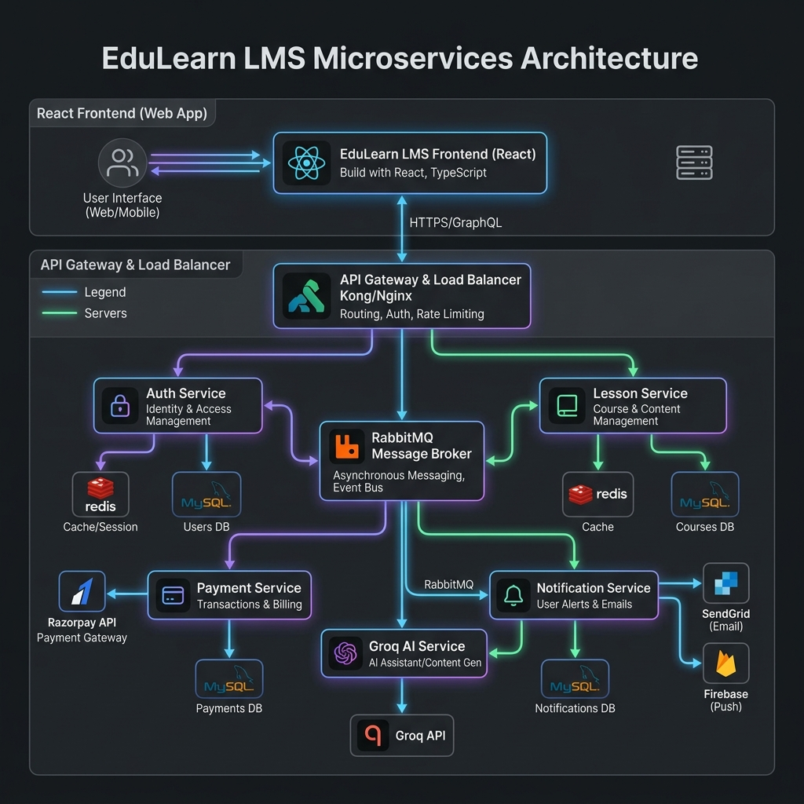
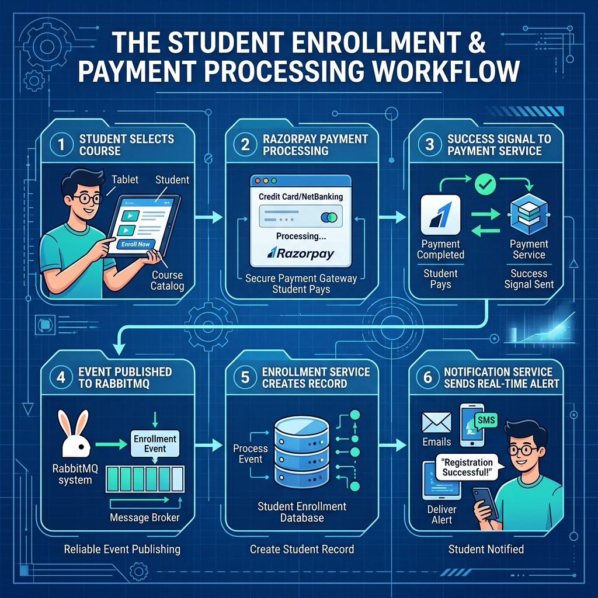

# 🎓 EduLearn LMS: Developer Walkthrough & System Design

Welcome to the comprehensive documentation for the **EduLearn Online Learning Management System**. This document outlines the architecture, data flows, and technology stack powering the platform.

## 🏗️ System Architecture
The platform is built on a **Microservices Architecture** using Spring Cloud. Each service is independent, own its own database (MySQL), and communicates via REST and asynchronous events (RabbitMQ).

### Core Components:
*   **API Gateway**: The entry point for all frontend requests, handling routing and security filters.
*   **Eureka Discovery**: Manages service registration and lookup.
*   **Auth Service**: Handles RBAC (Role-Based Access Control) and JWT issuance.
*   **Lesson Service**: The "Content Engine" managing courses, modules, and AI Tutor integrations.
*   **Payment Service**: Integrates with Razorpay for secure course transactions.
*   **Progress Service**: Tracks student activity, lesson completion, and course certificates.

---

## 🔄 Core Business Flows

### 1. Course Enrollment & Payment
When a student purchases a course, the system orchestrates a multi-service transaction involving Razorpay and RabbitMQ for eventual consistency.

### 2. AI Tutor Integration
The system uses **Groq (Llama 3)** to provide instant explanations. To minimize latency and costs, responses are cached in **Redis**.

### 3. Real-time Notifications
Notifications are pushed to the frontend via **WebSockets (STOMP)**. Events like "Course Published" or "Payment Successful" are routed through RabbitMQ.

---

## 📊 Data Model
The system uses a relational model optimized for tracking educational progress and financial records.

---

## 🛠️ Infrastructure & Tools

### Messaging: RabbitMQ
We use RabbitMQ for decoupling services. 
*   **Exchanges**: `course.exchange`, `payment.exchange`
*   **Queues**: `notification.queue`, `enrollment.queue`

### Caching: Redis
Used in the **Progress Service** to cache completion percentages and in the **Lesson Service** to cache AI-generated responses.

### Testing: Mailhog & SonarQube
*   **Mailhog**: Captures SMTP traffic from the `notification-service`.
*   **SonarQube**: Enforces code quality and ensures test coverage gates are met.

---

## 🚀 Getting Started
To run the entire stack locally:
1.  Ensure Docker Desktop is running.
2.  Run `docker-compose up -d`.
3.  Execute `mvn clean install` on the root project.
4.  Start services in order: Eureka, Config, Gateway, and then business services.
